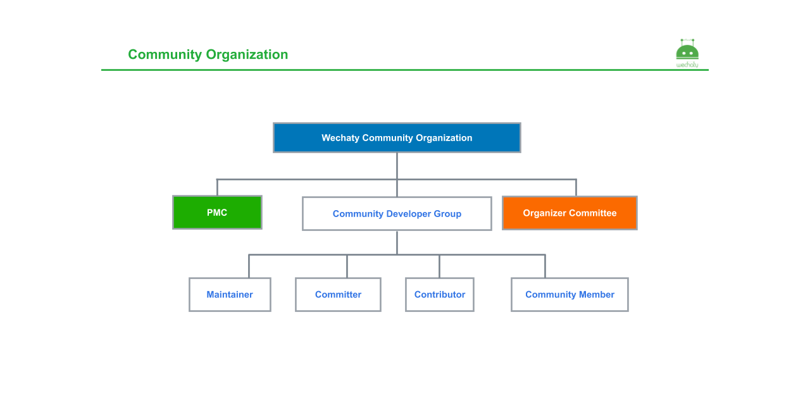

# Wechaty PMC

Wechaty Project Management Committee

## Resources

- Slides - [Open Source Wechaty](https://docs.google.com/presentation/d/1eRNrKnCpdnsmplTwtZzmtGZgrPoNCmOnitmHKVc6iVU/edit)
- Meeting Notes - [Wechaty Community Meeting Notes](https://docs.google.com/document/d/1fVCk8qRYc4RKGMf2UY5HOe07hEhPUOpGC34v88GEFJg/edit)
- YouTube Playlist - [Wechaty Events](https://www.youtube.com/playlist?list=PL8hd9KDTdarDXf_Rxtr8meKhxtgcXMInh)

## Wechaty Committers

- Cheng GONG, [@gcaufy](https://github.com/gcaufy), JavaScript([wechaty-plugin-contrib](https://github.com/wechaty/wechaty-plugin-contrib))
    1. Author of 20K+ star [WePY](https://github.com/tencent/wepy)
    1. Talk Video: [插件系统开发历程及应用, @gcaufy, May 30, 2020](https://www.youtube.com/watch?v=tfGZXoe_aA4&feature=youtu.be&list=PL8hd9KDTdarDXf_Rxtr8meKhxtgcXMInh&t=1480)
- Yuan GAO, [@windmemory](https://github.com/windmemory), TypeScript([wechaty-puppet-padplus](https://github.com/wechaty/wechaty-puppet-padplus))
    1. Co-founder & CTO, Juzi.BOT
    1. Talk Video: [Wechaty 插件的商业化落地展望, @windmemory, May 30, 2020](https://www.youtube.com/watch?v=tfGZXoe_aA4&feature=youtu.be&list=PL8hd9KDTdarDXf_Rxtr8meKhxtgcXMInh&t=3660)
    1. Talk Video: [Wonderful Wechaty DevOps Tool set, @windmemory, Jun 19, 2020](https://www.youtube.com/watch?v=fluenDIHZec&list=PL8hd9KDTdarDXf_Rxtr8meKhxtgcXMInh&index=17&t=4445)
- Jingjing WU, [@wj-Mcat](https://github.com/wj-Mcat), Python([python-wechaty](https://github.com/wechaty/python-wechaty))
    1. Talk Video: [Just 0.1% of the Python Wechaty, @wj-Mcat, Apr 17, 2020](https://www.youtube.com/watch?v=ZX_Pb9fRwS4&feature=youtu.be&list=PL8hd9KDTdarDXf_Rxtr8meKhxtgcXMInh&t=1073)
    1. Talk Video: [Log/Exception/Interface Design, @wj-Mcat, May 9, 2020](https://www.youtube.com/watch?v=6VhrXaT7clQ&feature=youtu.be&list=PL8hd9KDTdarDXf_Rxtr8meKhxtgcXMInh&t=1060)
    1. Talk Video: [Introduction for python Wechaty, @wj-Mcat, Jun 19, 2020](https://www.youtube.com/watch?v=fluenDIHZec&list=PL8hd9KDTdarDXf_Rxtr8meKhxtgcXMInh&index=17&t=1772)
- Chunhong HUANG, [@huangaszaq](https://github.com/huangaszaq), Python([python-wechaty](https://github.com/wechaty/python-wechaty))
- Zhengxin DIAO, [@diaozxin007](https://github.com/diaozxin007), Java([java-wechaty](https://github.com/wechaty/java-wechaty))
    1. Talk Video: [从 Java 开发者的角度谈 Wechaty：技术选型和架构畅想, @diaozxin007, Apr 17, 2020](https://www.youtube.com/watch?v=ZX_Pb9fRwS4&feature=youtu.be&list=PL8hd9KDTdarDXf_Rxtr8meKhxtgcXMInh&t=2108)
    1. Talk Video: [introduce kotlin-wechaty progress, @diaozxin007, May 9, 2020](https://www.youtube.com/watch?v=6VhrXaT7clQ&feature=youtu.be&list=PL8hd9KDTdarDXf_Rxtr8meKhxtgcXMInh&t=3050)
    1. Talk Video: [漫谈Java Wechaty, @diaozxin007, Jun 19, 2020](https://www.youtube.com/watch?v=fluenDIHZec&list=PL8hd9KDTdarDXf_Rxtr8meKhxtgcXMInh&index=17&t=2477)
- Xiaoya REN, [@redmaple1](https://github.com/redmaple1), Java([java-wechaty](https://github.com/wechaty/java-wechaty))
    1. Talk Video: [puppet manager 的实现, @redmaple1, Jun 19, 2020](https://www.youtube.com/watch?v=fluenDIHZec&list=PL8hd9KDTdarDXf_Rxtr8meKhxtgcXMInh&index=17&t=3163)
- Xiaoyu DING, [@dingdayu](https://github.com/dingdayu), Go([go-wechaty](https://github.com/wechaty/go-wechaty))
    1. Talk Video: [从 Go 的角度理解 Wechaty：为什么这样做；及对 Todo 划分的思考, @dingdayu, Apr 17, 2020](https://www.youtube.com/watch?v=ZX_Pb9fRwS4&feature=youtu.be&list=PL8hd9KDTdarDXf_Rxtr8meKhxtgcXMInh&t=2108)
- Chaofei DING, [@dchaofei](https://github.com/dchaofei), Go([go-wechaty](https://github.com/wechaty/go-wechaty))
    1. Talk Video: [Go Wechaty 开发分享, @dchaofei, Apr 17, 2020](https://youtu.be/ZX_Pb9fRwS4?list=PL8hd9KDTdarDXf_Rxtr8meKhxtgcXMInh&t=1723)
    1. Talk Video: [聊一下go Wechaty, @dchaofei, Jun 19, 2020](https://www.youtube.com/watch?v=fluenDIHZec&list=PL8hd9KDTdarDXf_Rxtr8meKhxtgcXMInh&index=17&t=3678)
- Bojie LI, [@silkageNet](https://github.com/silkageNet), Go([go-wechaty](https://github.com/wechaty/gp-wechaty))
    1. Talk Video: [Golang里的EventEmitter, @silkageNet, Apr 17, 2020](https://www.youtube.com/watch?v=ZX_Pb9fRwS4&feature=youtu.be&list=PL8hd9KDTdarDXf_Rxtr8meKhxtgcXMInh&t=5270)
- Jun CAI, [@jcai](https://github.com/jcai/), Scala([scala-wechaty](https://github.com/wechaty/scala-wechaty))
    1. Talk Video: [Scala Wechaty Beta Release Talk, @jcai, Jun 19, 2020](https://www.youtube.com/watch?v=znMn1NgnngE&list=PL8hd9KDTdarDXf_Rxtr8meKhxtgcXMInh&index=18)

## Authors

1. [Huan LI](http://linkedin.com/in/zixia), [@huan](https://github.com/huan), PreAngel Partner, Tencent TVP of Chatbot.
    1. Talk Video: [Wechaty 101 - from v0.0 to v0.7, @huan, Dec 12, 2016](https://www.youtube.com/watch?v=39TteTtCkd4&list=PL8hd9KDTdarDXf_Rxtr8meKhxtgcXMInh&index=7)
    1. Talk Video: [Multi-language Wechaty Kickoff: Introduction, @huan, Apr 17, 2020](https://www.youtube.com/watch?v=ZX_Pb9fRwS4&feature=youtu.be&list=PL8hd9KDTdarDXf_Rxtr8meKhxtgcXMInh&t=165)
    1. Talk Video: [Introduce StateSwitch & Puppet Design, @huan, May 9, 2020](https://youtu.be/6VhrXaT7clQ?list=PL8hd9KDTdarDXf_Rxtr8meKhxtgcXMInh&t=3989)
    1. Talk Video: [Wechaty 開源故事 (Azure Show 第一期), @huan, May 19, 2020](https://www.youtube.com/watch?v=YZ130iwcNSE&list=PL8hd9KDTdarDXf_Rxtr8meKhxtgcXMInh&index=13)
    1. Talk Video: [Wechaty项目和社区生态介绍, @huan, May 30, 2020](https://www.youtube.com/watch?v=tfGZXoe_aA4&feature=youtu.be&list=PL8hd9KDTdarDXf_Rxtr8meKhxtgcXMInh&t=385)
    1. Talk Video: [How to getting started with Multi-language Wechaty, @huan, Jun 19, 2020](https://www.youtube.com/watch?v=fluenDIHZec&list=PL8hd9KDTdarDXf_Rxtr8meKhxtgcXMInh&index=17&t=6170)

1. [Jiarui LI](https://github.com/lijiarui), Founder & CEO of Juzi.BOT, Microsoft AI MVP.
    1. Talk Video: [Getting Started with Wechaty(Docker) - Live Coding Tutorial, @lijiarui, Dec 12, 2016](https://www.youtube.com/watch?v=IUDuxHaV9bQ&list=PL8hd9KDTdarDXf_Rxtr8meKhxtgcXMInh&index=6)
    1. Talk Video: [Wechaty 快速开始 (Live Coding), @lijiarui, Jul 18, 2018](https://www.youtube.com/watch?v=KO23WAlnPHg&list=PL8hd9KDTdarDXf_Rxtr8meKhxtgcXMInh&index=2)
    1. Talk Video: [Global AI Bootcamp 2019 - Beijing - 如何从0到1搭建 Chatbot, @lijiarui, Dec 22, 2019](https://www.youtube.com/watch?v=bdq8VNuHvVo&list=PL8hd9KDTdarDXf_Rxtr8meKhxtgcXMInh&index=2)
    1. Talk Video: [Wechaty 從零開始 Live Coding with QnAMaker.ai (Azure Show第一期), @lijiarui, May 19, 2020](https://www.youtube.com/watch?v=ZYjYAT2g-1Q&list=PL8hd9KDTdarDXf_Rxtr8meKhxtgcXMInh&index=14)
    1. Talk Video: [Multi-language Wechaty Roadmap, @lijiarui, Jun 19, 2020](https://www.youtube.com/watch?v=fluenDIHZec&list=PL8hd9KDTdarDXf_Rxtr8meKhxtgcXMInh&index=17&t=364)

### See Also

- [Apache Project Management Committees (PMC)](https://www.apache.org/foundation/how-it-works.html#pmc)
- [步进式解读Apache许可证](https://mp.weixin.qq.com/s/_uyedP8LbuwSwj79GsI4Yw)

## Copyright & License

- Code & Docs © 2016 Wechaty Contributors <https://github.com/wechaty>
- Code released under the Apache-2.0 License
- Docs released under Creative Commons
